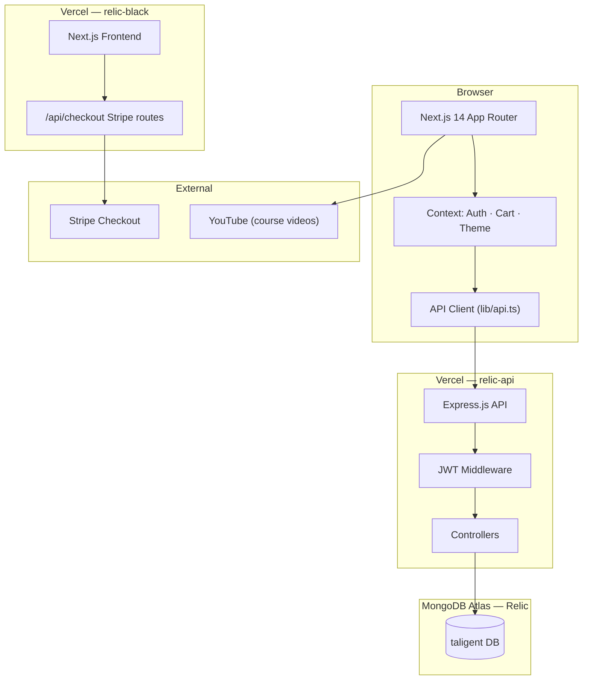
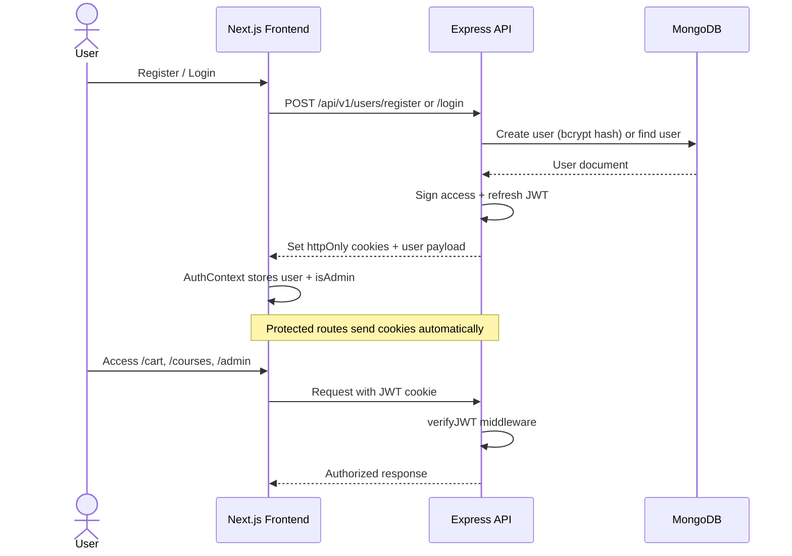
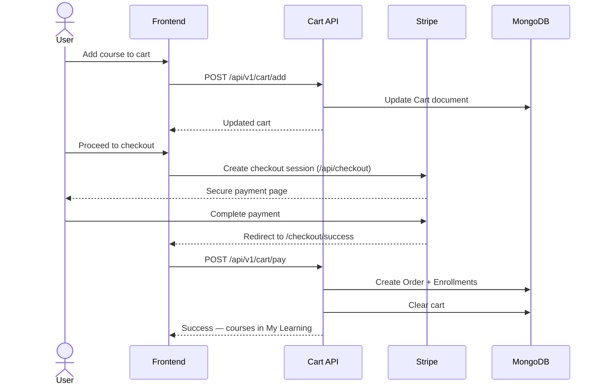
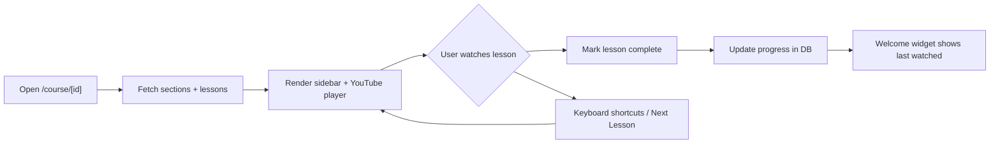

# Relic

**A Coursera-style learning platform** — browse courses, enroll via Stripe checkout, and track lesson progress with a custom YouTube player.

[](https://relic-black.vercel.app)
[](https://relic-api-sigma.vercel.app/api/v1/health)

| | |
|---|---|
| **Frontend** | [relic-black.vercel.app](https://relic-black.vercel.app) |
| **Backend API** | [relic-api-sigma.vercel.app](https://relic-api-sigma.vercel.app) |
| **Stack** | Next.js 14 · TypeScript · Express · MongoDB Atlas · JWT · Stripe |

---

## Overview

Relic is a full-stack e-learning app with a Coursera-inspired homepage, JWT auth, shopping cart, Stripe payments, course player with section/lesson navigation, reviews & ratings, admin dashboard, and dark mode.

**Seeded content:** 6 courses including *Machine Learning Fundamentals* with 134 CampusX video lessons.

---

## Architecture



---

## Authentication Flow



---

## Purchase & Enrollment Flow



---

## Course Player & Progress Flow



---

## Tech Stack

### Frontend
- Next.js 14 (App Router)
- TypeScript
- CSS Modules + design tokens
- Context API (Auth, Cart, Theme)
- Stripe.js checkout integration

### Backend
- Express.js (Vercel serverless)
- MongoDB Atlas + Mongoose
- JWT auth (access + refresh tokens, httpOnly cookies)
- bcrypt password hashing
- Role-based access (admin / user)

### Deployment
- **Frontend:** Vercel → `relic-black.vercel.app`
- **Backend:** Vercel → `relic-api-sigma.vercel.app`
- **Database:** MongoDB Atlas (dedicated Relic project)

---

## Project Structure

```
Relic/
├── frontend/                 # Next.js frontend
│   └── src/
│       ├── app/              # Pages + API routes (Stripe checkout)
│       ├── components/       # UI components
│       ├── context/          # Auth, Cart, Theme providers
│       ├── lib/              # API client
│       └── styles/           # Global styles + design tokens
│
└── backend/                  # Express.js backend
    └── src/
        ├── controllers/      # Route handlers
        ├── models/           # Mongoose models
        ├── routes/           # API routes
        ├── services/         # Cart, enrollment, cron
        ├── middlewares/      # JWT, DB connection (serverless-safe)
        └── scripts/seed.js   # DB seeder (6 courses, 174 lessons)
```

---

## Getting Started

### Prerequisites
- Node.js 18+
- MongoDB Atlas cluster
- Stripe test keys (optional, for checkout)

### 1. Clone & install

```bash
git clone https://github.com/pracheersrivastava/Relic.git
cd Relic
```

### 2. Backend

```bash
cd backend
cp .env.example .env   # create from template if available
npm install
npm run dev            # http://localhost:5000
```

### 3. Seed database (optional)

```bash
npm run seed
```

Creates admin + demo users and 6 courses with lessons.

### 4. Frontend

```bash
cd frontend
npm install
npm run dev            # http://localhost:3000
```

---

## Pages

| Route | Description |
|-------|-------------|
| `/` | Homepage — course grid, carousels, welcome widget |
| `/login` | Login / register |
| `/courses` | My Learning — enrolled courses |
| `/cart` | Shopping cart |
| `/checkout` | Stripe checkout redirect |
| `/course/[id]` | Course player — video, sections, reviews |
| `/admin` | Admin dashboard (admin role only) |

---

## Features

- **Homepage** — Coursera-style hero, category cards, auto-scrolling carousels, ratings from DB
- **Authentication** — JWT register/login, change password, role-based access
- **Shopping cart** — Add/remove courses, Stripe checkout, enrollment on payment
- **Course player** — Custom YouTube player, keyboard shortcuts, next-lesson auto-advance
- **Reviews & ratings** — Submit/edit reviews; course `averageRating` updates automatically
- **Lesson progress** — Backend-tracked completion + welcome widget for last watched
- **Admin dashboard** — Live stats (users, courses, orders, revenue)
- **Dark mode** — Light/dark theme toggle with glassmorphism UI
- **Responsive** — Desktop and mobile layouts

---

## API Endpoints

### Authentication
| Method | Endpoint | Auth | Description |
|--------|----------|------|-------------|
| POST | `/api/v1/users/register` | No | Register new user |
| POST | `/api/v1/users/login` | No | Login user |
| POST | `/api/v1/users/logout` | Yes | Logout user |
| POST | `/api/v1/users/change-password` | Yes | Change password |

### Courses
| Method | Endpoint | Auth | Description |
|--------|----------|------|-------------|
| GET | `/api/v1/courses/all-courses` | No | All courses (with ratings) |
| GET | `/api/v1/courses/my-courses` | Yes | Enrolled courses |
| POST | `/api/v1/courses/my-courses/:courseId/review` | Yes | Submit review |
| GET | `/api/v1/courses/my-courses/:courseId/review` | Yes | Get user's review |

### Sections
| Method | Endpoint | Auth | Description |
|--------|----------|------|-------------|
| GET | `/api/v1/section/courses/:courseId/sections` | No | Course sections + lessons |

### Cart
| Method | Endpoint | Auth | Description |
|--------|----------|------|-------------|
| GET | `/api/v1/cart` | Yes | Get cart |
| POST | `/api/v1/cart/add` | Yes | Add course |
| DELETE | `/api/v1/cart/remove/:courseId` | Yes | Remove course |
| POST | `/api/v1/cart/pay` | Yes | Complete purchase |
| DELETE | `/api/v1/cart/clear` | Yes | Clear cart |

### Admin
| Method | Endpoint | Auth | Description |
|--------|----------|------|-------------|
| GET | `/api/v1/dashboard/stats` | Admin | Platform statistics |
| GET | `/api/v1/health` | No | Health check |

---

## Environment Variables

### Backend `.env`
```env
MONGODB_URI=mongodb+srv://<user>:<pass>@<cluster>/taligent
PORT=5000
ACCESS_TOKEN_SECRET=your_secret
REFRESH_TOKEN_SECRET=your_secret
ACCESS_TOKEN_EXPIRY=1d
REFRESH_TOKEN_EXPIRY=30d
FRONTEND_URL=http://localhost:3000
BACKEND_URL=http://localhost:5000
```

### Frontend `.env.local`
```env
STRIPE_SECRET_KEY=sk_test_...
NEXT_PUBLIC_STRIPE_PUBLISHABLE_KEY=pk_test_...
NEXT_PUBLIC_API_BASE_URL=http://localhost:5000/api/v1
```

---

## Author

**Pracheer Srivastava** — [GitHub](https://github.com/pracheersrivastava) · [LinkedIn](https://www.linkedin.com/in/pracheersrivastava)

---

## License

This project is open source for portfolio and learning purposes.
